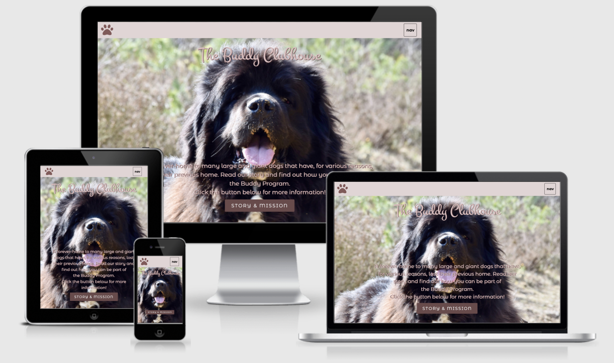
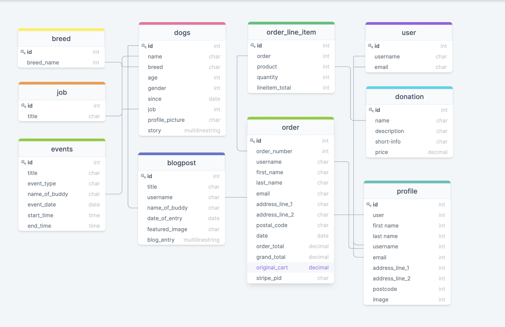

### Code Institute Milestone Four Project
> Full Stack Frameworks with Django

# THE BUDDY CLUBHOUSE
## Purpose
### This is the fourth and final required project of the Fullstack Software Development Diploma from Code Institute. 
### This project seeks to showcase the collective knowledge gained throughout the course using:
* Django/Python MVC Framework 
* Relational Data Modeling
* Authentication and Authorisation
* CRUD functionality
* E-commerce payment implementation 
* Version Control
* Deployment and cloud hosting

## The Project
### A website of a forever-home for large dogs that have, at some point in their lives, lost their previous homes. To provide the dogs with a balanced life, they are sent on training for particular skills they show an aptitude for.
### The aim of the website:
* give people who love large breed dogs, but might not have the space or time to have one as a regular pet, the opportunity to spend quality time with them
* give the dogs the social interaction with people they need
* generate some donation from users to help with the upkeep of the dogs
* give users a blog space to share their encounter with the dogs

&nbsp;

### **View this project live:** [The Buddy Clubhouse](https://the-buddy-clubhouse-ms4.herokuapp.com/)
#### Stripe functionality is set up to be in a test mode. Please do not enter your personal card number when checking out an order. Please use as follows:
    - card number: 4242 4242 4242 4242 
    - date: 04 24
    - CVV: 424

### **The Repository can be found here:** [The Buddy Clubhouse Source Code](https://github.com/finnsterfran/BuddyClubhouse-MS4)

##### **Disclaimer:** This work is for educational purposes only and used for the obtainment of an academic grade. This is a work of fiction. Unless otherwise indicated, all the names, characters, businesses, places, events and incidents in this book are either the product of the author's imagination or used in a fictitious manner. Any resemblance to actual persons, living or dead, or actual events is purely coincidental.

&nbsp;

# TABLE OF CONTENT
1. [USER STORY](#user_story)
2. [DESIGN](#design)
3. [INFORMATION ARCHITECTURE](#information_architecture)
4. [WIREFRAMES AND SCREENSHOOTS](!WIREFRAMES.md)
5. [TECHNOLOGIES USED](#technologies_used)
6. [TESTING](TESTING.md)
7. [BUGS AND PROBLEMS](#bugs_and_problems)
8. [FEATURES](#features)
9. [DEPLOYMENT](#deployment)
10. [CREDIT AND ACKNOWLEDGEMENT](#credit_and_acknowledgement)

&nbsp;

# USER STORY
### Visitor to the website:
* I want to have a rough idea what this website is about from just glancing at information on the landing page.
* I want easy navigation through the website.
* I want to be able to get further information about this website and its purpose.
* I want to be able to look at pictures and read a little about the dogs.
* I want spend time with the dogs. 
* I want to help, what can I do?

### These goals are accomplished via: 
* Brief information on the homepage will give an immediate idea of what this website is about.
* Collapsible navigation block to the right side of the page provides navigation to every page that is available to non-registered users.
* User will be directed to further information (story and mission) via a button on the landing page. 
* An image and information of the individual dogs will be viewable on their profile page.
* Information about visitations (activities). 
* User can make a monetary contribution towards the upkeep of the dogs.
* User will be informed that registration is required for certain parts of the website.

### Registered users:
* I want to spend time with the dogs, when can I? What can I do with the dogs?
* The profile photo is terrible, and I made a typo in my name in the registration form, how can I change this?
* I want to be able to blog about my day with the dog I had a playdate with.
* I want to keep track of any donations I have made.

### These goals are accomplished via: 
* Registered users will get access to the events page which will show what activities will be happening. 
* Registered users will be able partake in activities that are open to users. 
* Registered users will be able to edit their profiles via their account page.
* Registered users will be able to contribute blog post about their interaction with the dog/dogs.
* Registered users will be able to see the history of any orders they have made via their account page.

&nbsp;

# STRUCTURE
#### The project structure can be seen here [structure](structure.txt)

&nbsp;

# DESIGN
## Color Palettes

&nbsp;

&nbsp;

## Typography
#### font-family: 'Montez', cursive;
#### font-family: 'Montserrat Alternates', sans-serif;

&nbsp;

## Icons/Images
#### All icons used in this project are from [FontAwesome](https://fontawesome.com/)
#### All dog images, with the exception of Daisy and Wookiepants, were from various sources on the internet.
#### Default-blog and default-profile images were sourced from the internet.

&nbsp;

# INFORMATION ARCHITECTURE
## Data Relationship Model made at [DrawSQL](https://drawsql.app/)
### There are 11 models in this project, here are the relationships:
#### 1. Dog 
* the breed field in this model is related to the Breed model
* the job field in this model is related to Job model
#### 2. Events
* the buddy_name field in this model is related to Dog model
* the event_type field in this model is related to Event_type model
#### 3. Profile
* the username field in this model is related to User model
#### 4. Blogboard
* the name_of_buddy field in this model is related to Dog model
* the username field in this model is related to Profile
#### 5. Order
* if user was logged in when order was made, the username, email, address_line_1, address_line_2 and postal_code fields are related
to Profile model
* the order_number field in this model is related to OrderLineItem model
#### 6. OrderLineItem 
* the product field in this model is related to Donation model

&nbsp;

# WIREFRAMES AND SCREENSHOTS 
[Wireframes and screenshots](WIREFRAMES.md)

&nbsp;

# TECHNOLOGIES USED
## HTML
### The skeleton of each webpage in the website was built using HTML5.

## CSS
### The styling layout and media queries were done in stylesheets using CSS.

## Bootstrap 5.1.3
### This CSS framework was heavily utilized in this project. 

## jQuery 
### jQuery was used mostly for control alert messages duration and form update. 
note : jQuery was implemented through a bundle from Bootstrap. 

## Javacript
### Javascript was used for stripe functionality.

## Python 
### Django was the framework used for this project.
### Packages I installed in this project:
* boto3==1.20.23  (needed to connect Django to AWS-S3)
* coverage==6.2 (to generate a report on testing)
* dj-database-url==0.5.0 (needed to get connected to a Heroku Postgres Database)
* Django==3.2.8 (the framework)
* django-allauth==0.45.0 (account making and authentication, although I used a custom login and register form)
* django-crispy-forms==1.13.0 (used to punch out form templates for checkout form)
* django-storages==1.12.3 (needed, together with boto3 to connect to storage of static and media folder)
* gunicorn==20.1.0 (needed to be able to deploy to Heroku)
* Pillow==8.4.0 (needed for uploading of images)
* psycopg2==2.9.2 
* psycopg2-binary==2.9.2 (needed for connection to the Postgres URL)
* python-decouple==3.5 (used in development to hid secret keys)
* stripe==2.63.0 (needed to utilize stripe payment platform)
Note: some packages not listed here came preinstalled when using Code Institute Full Template.

## Dev Environment    
* [Gitpod](https://gitpod.io/): The online IDE I used to write my codes in.
* [Github](https://github.com/): My repository is housed here.
* My browser choice for this project is Google Chrome.
* I used Git for version control.
* [Heroku](https://heroku.com/): My Postgres Database sits on Heroku and I use Heroku to deploy my website.
* [AWS](https://aws.amazon.com/): My static and media files are hosted by Amazon's AWS S3.

&nbsp;

# TESTING
[Testing documentation](TESTING.md)

&nbsp;

# BUGS AND PROBLEMS
### Problem: There was quite a bit of trouble with email sending via gmail. Even with the correct variables included in Heroku, the smtp authentication returned errors. 
    * Troubleshooting:
        * on 11 December 2021, worked with Jo from tutor help to fix the problem. Made one-time pass again, re-entered all variable details. Doubled checked, tutor double checked. 
        * test registering an account on project website. Confirmation email failed to send.
        * test make an order on project website. Order confirmation email not received.
        * double checked signals.py. setting is okay.
        * two hours later, received email for order confirmation but not for registration of account.
        * registration still throws an smtp authentication error.
        * re-entered all variables, made one-time pass.
        * registration successful, confirmation email received.
        * on 12 December 2021, tried to make a new user account on project website. Authentication error again.
        * checked gmail, checked gmail activity log - ** account was disabled ** for some reason.
        * made new one-time pass, made sure to confirm activity "this was me" in activity log.
        * per advice by Ed from tutor help, I switched email verification to 'optional'.
        * email sending fixed.
### Problem: Gitpod update caused freezing requirements.txt to save 125 packages.
    * Troubleshooting:
        * used code provided by Code Institute to override the docker setting in gitpod.
        * cut and paste the requirements.txt into a cleaner to remove unwanted packages and returned the trimmed version back to my project's requiremenst.txt file.
        * this did not solve the problem. freezing requirements.txt upon installing a new package will again add 125 packages to the file.
        * opened a new workspace, this seemed to have fixed the issue.

# FEATURES
### Navigation
* I used bootstrap's offcanvas navigation that toggles open and close on the right of the page.
* The navigation links changes depending on if the user is logged in or not.
* Standard offcanvas navigation panel shows:
    * a search bar to search by dog name and a search submit button
    * home - to return to homepage
    * our story - to story and mission page
    * donation - to contribution page where donation packages can be purchased
    * the buddies - to page of all the dogs
    * blogboard - to blogboard page that host all blogs that have been posted by users
    * register - to registration page to sign up for a new user account
* When user is logged in, offcanvas navigation panel will also show:
    * my account - to logged in user's account page
    * logout - to log out of account
    * events - to events page to see the upcoming events
    * members - to see all registered members 
### Homepage 
* Short summary and a button that links to more information
### Our Story 
* Story and mission message
* Buttons that lead to Contribute, Contact Us and Register pages
### Donation
* A contribution page where users can select from 6 donation packages to purchase/donate.
* Cart button leads to cart page.
* If cart is empty, button 'Keep Shoppng' will bring the user back to Donation page.
* If cart is not empty, second button 'Secure Checkout' will bring user to checkout page.
### Checkout
* A checkout form with credit card input. 
* User will be able to go back to adjust cart items by clicking 'Adjust bag'.
* User can choose to login or create an account.
* Logged in user can choose to have this order saved to profile.
* If user is logged in, information that was stored in user profile will be used to prefill the form.
* Complete order by filling in all fields in the form and click 'Complete Order'.
### Blogboard
* A page with all the blogs written by registered members of the website.
* Individual 
### The Buddies 
* Page with all the dogs in the sanctuary.
* Clicking on dog icon will lead the user to individual dog page.
### Register 
* Registration form to create a new user account.
* Successful registration will bring the user directly to their account page to update their profile.
### Events 
* Only accessible to 

# DEPLOYMENT
[Deployment](DEPLOYMENT.md)

# CREDIT AND ACKNOWLEDGEMENT
### Email Sending via GMAIL

