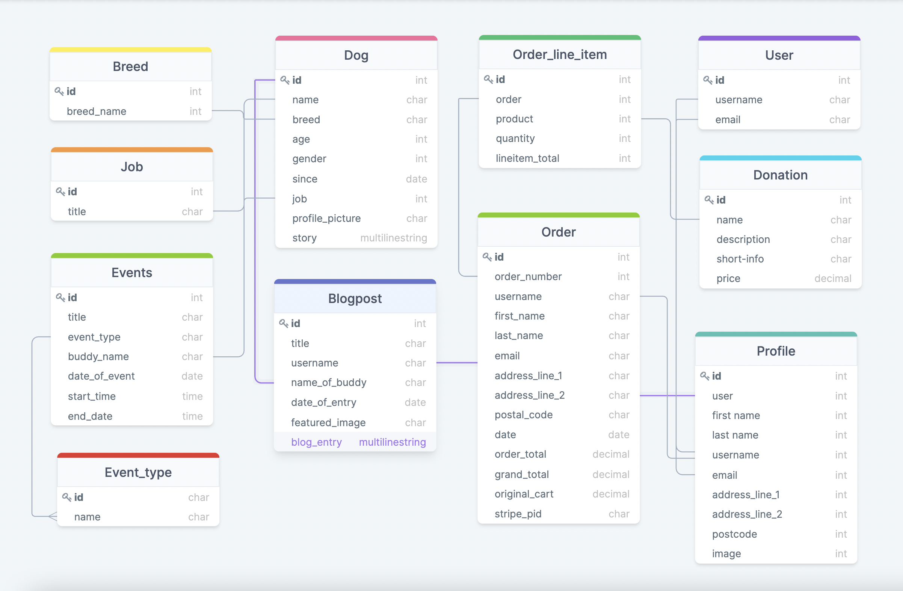

### Code Institute Milestone Four Project
> Full Stack Frameworks with Django

&nbsp;

# THE BUDDY CLUBHOUSE
### This project features a website for a forever-home for large dogs that have, at some point in their lives, lost their previous homes. To provide the dogs with a balanced life, they are sent on training for particular skills they show an aptitude for. 

### The aim of the website is to:
* give people who love large breed dogs, but might not have the space or time to have one as a regular pet, the opportunity to spend quality time with them
* give the dogs the social interaction with people they need
* generate some donation from users to help with the upkeep of the dogs

# TABLE OF CONTENT
1. [USER STORY](#user_story)
2. [STRATEGY](#strategy)

### User registration is required to be able to post a blog and to access the events calendar.

&nbsp;

### **View this project live:** [The Buddy Clubhouse](https://the-buddy-clubhouse-ms4.herokuapp.com/)

&nbsp;

### **The Repository can be found here:** [The Buddy Clubhouse Source Code](https://github.com/finnsterfran/BuddyClubhouse-MS4)

&nbsp;

# UX
## USER STORY
### Visitor to the website:
    * I want to have a rough idea what this website is about from just glancing at information on the landing page.
    * I want easy navigation through the website.
    * I want to be able to get further information about this website and its purpose.
    * I want to be able to look at pictures and read a little about the dogs.
    * I want spend time with the dogs. 
    * I want to help, what can I do?

&nbsp;

### These goals are accomplished via: 
    * Brief information on the homepage will give an immediate idea of what this website is about.
    * Collapsible navigation block to the right side of the page provides navigation to every page that is available to non-registered users.
    * User will be directed to further information (story and mission) via a button on the landing page. 
    * An image and information of the individual dogs will be viewable on their profile page.
    * Information about visitations (activities). 
    * User can make a monetary contribution towards the upkeep of the dogs.
    * User will be informed that registration is required for certain parts of the website.

### Registered users:
    * I want to spend time with the dogs, when can I? What can I do with the dogs?
    * The profile photo is terrible, and I made a typo in my name in the registration form, how can I change this?
    * I want to be able to blog about my day with the dog I had a playdate with.
    * I want to keep track of any donations I have made.

### These goals are accomplished via: 
    * Registered users will get access to the events page which will show what activities will be happening. 
    * Registered users will be able partake in activities that are open to users. 
    * Registered users will be able to edit their profiles via their account page.
    * Registered users will be able to contribute blog post about their interaction with the dog/dogs.
    * Registered users will be able to see the history of any orders they have made via their account page.

## STRATEGY

## SCOPE
## STRUCTURE

## SKELETON
## SURFACE
### Colors
### Typography
font-family: 'Montez', cursive;
font-family: 'Montserrat Alternates', sans-serif;
### Icons/Images

# INFORMATION ARCHITECTURE
## Data Relationship Model made at [DrawSQL](https://drawsql.app/)

## Wireframes 

## Screenshots

# TECHNOLOGIES USED
## HTML
    * The skeleton of each webpage in the website was built using HTML5.

## CSS
    * The styling layout and media queries were done in stylesheets using CSS.

## Bootstrap 5.1.3
    * This CSS framework was heavily used in this project. 

## jQuery 
    * jQuery was used mostly for control alert messages duration and form update. 
    note : jQuery was implemented through a bundle from Bootstrap. 

## Javacript
    * Javascript was used for stripe functionality.

## Python 
    * Django was the framework used for this project.
    * Packages I installed in this project:
        * boto3==1.20.23  (needed to connect Django to AWS-S3)
        * coverage==6.2 (to generate a report on testing)
        * dj-database-url==0.5.0 (needed to get connected to a Heroku Postgres Database)
        * Django==3.2.8 (the framework)
        * django-allauth==0.45.0 (account making and authentication, although I used a custom login and register form)
        * django-crispy-forms==1.13.0 (used to punch out form templates for checkout form)
        * django-storages==1.12.3 (needed, together with boto3 to connect to storage of static and media folder)
        * gunicorn==20.1.0 (needed to connect to Heroku)
        * Pillow==8.4.0 (to permit uploading of images)
        * psycopg2==2.9.2 
        * psycopg2-binary==2.9.2 (needed for connection to the Postgres URL)
        * python-decouple==3.5 (used in development to hid secret keys)
        * stripe==2.63.0 (needed to utilize stripe payment platform)
    Note: some packages not listed here came preinstalled when using Code Institute Full Template.

## Dev Environment    
* [Gitpod](https://gitpod.io/): The online IDE I used to write my codes in.
* [Github](https://github.com/): My repository is housed here.
* My browser choice for this project is Google Chrome.
* I used Git for version control.
* [Heroku](https://heroku.com/): My Postgres Database sits on Heroku and I use Heroku to deploy my website.
* [AWS](https://aws.amazon.com/): My static and media files are hosted by Amazon's AWS S3.

# TESTING

## 

# FEATURES

# DEPLOYMENT
## Github
## Heroku
## AWS

# CREDIT AND ACKNOWLEDGEMENT
 
