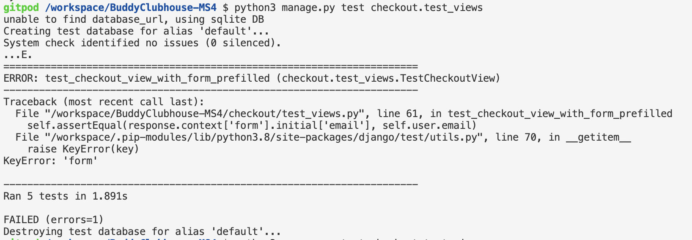
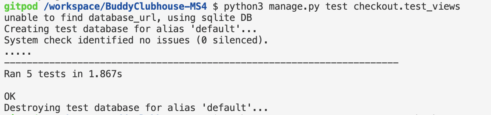
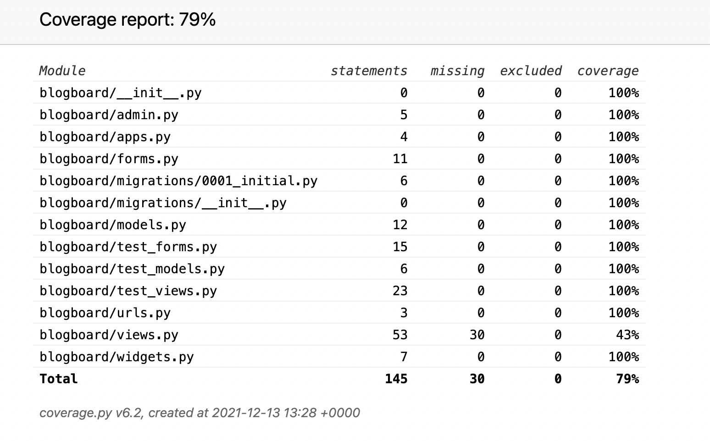
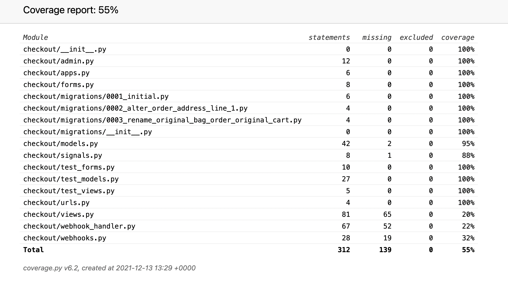
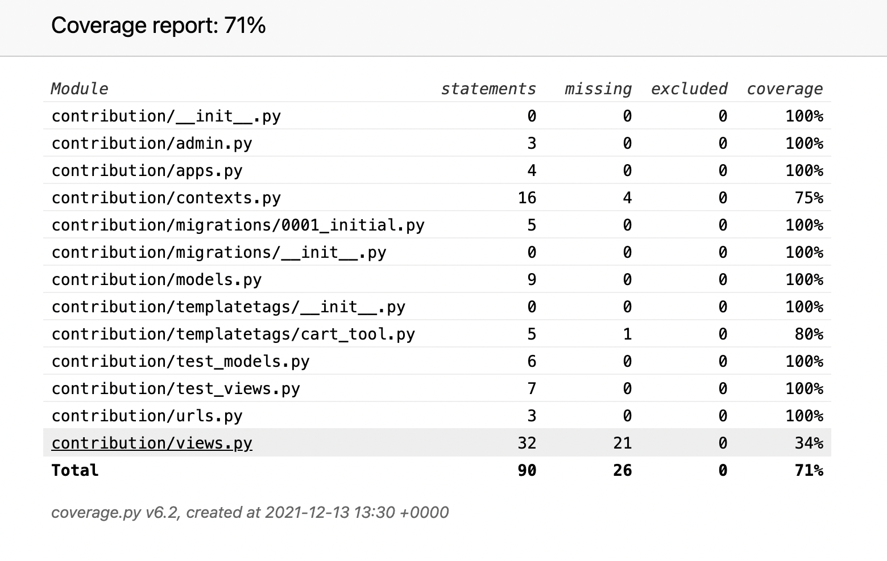
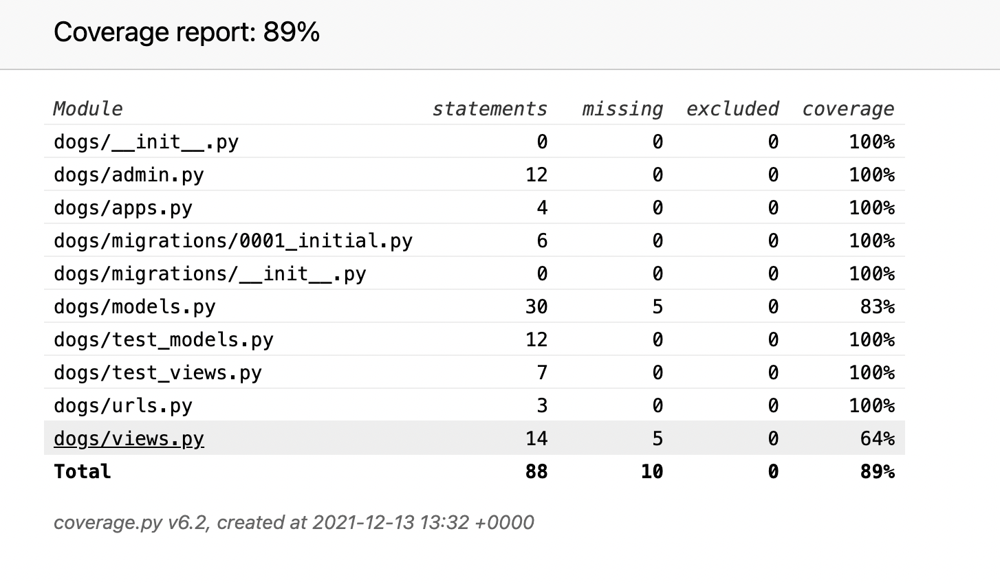
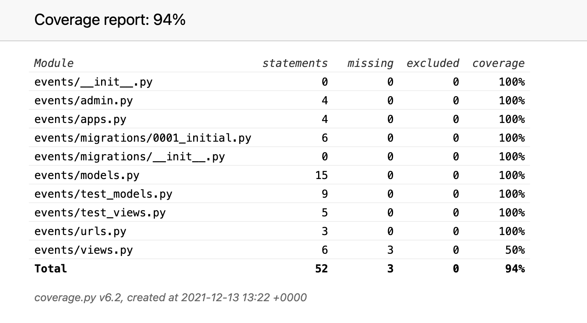
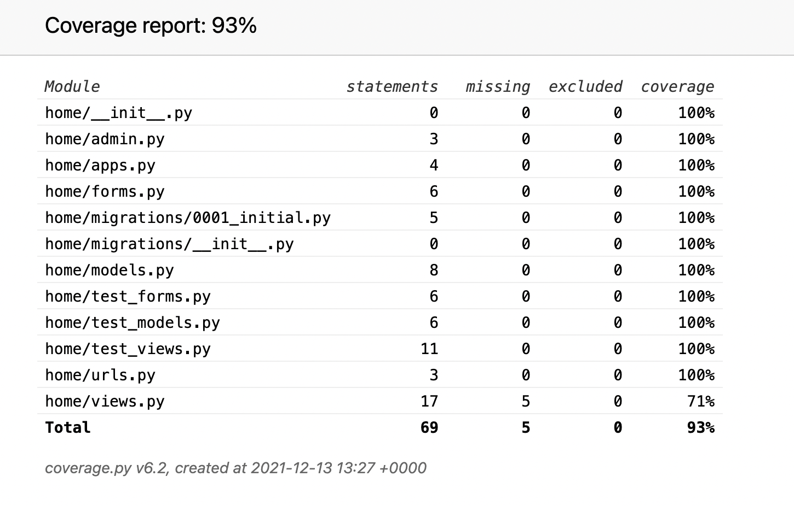
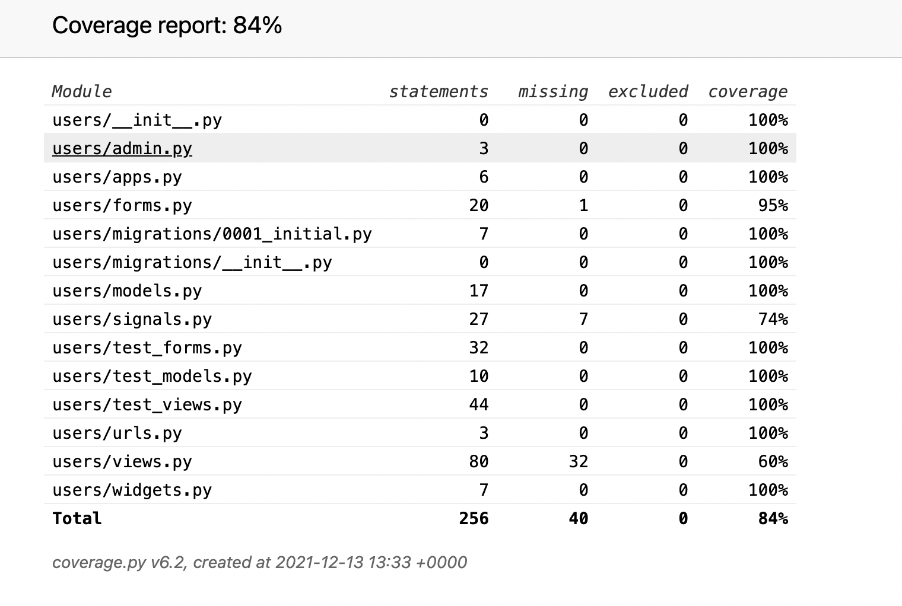
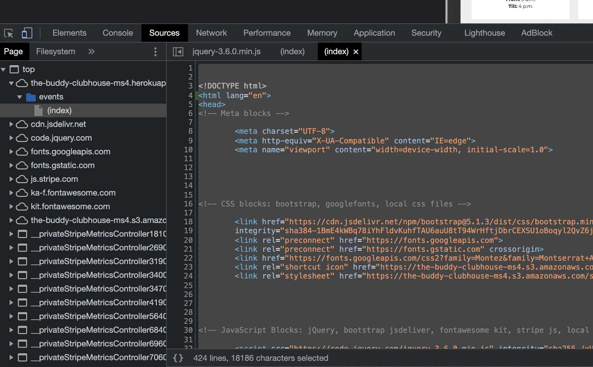

# Test User Story
    * I want to have a rough idea what this website is about from just glancing at information on the landing page.
        * Summary of homepage informs what the site is about. Except on mobile view where summary is hidden.
    * I want easy navigation through the website.
        * Offcanvas navigation opens to the right of the webpage. Appropriate branch links are placed on each webpage. 
    * I want to be able to get further information about this website and its purpose.
        * Story and Mission fulfills this.
    * I want to be able to look at pictures and read a little about the dogs.
        * The buddies page holds information about all the dogs. Individual page opens to show a short background read about the dog.
    * I want spend time with the dogs. 
        * Event are open to members, user should register as a member in order to spend time with the dogs.
    * I want to help, what can I do?
        * Contribution page shows donation options that users can choose from to help.
    * I want to spend time with the dogs, when can I? What can I do with the dogs?
        * Events are open to members - playdates, hikes, help with grooming, etc.
    * The profile photo is terrible, and I made a typo in my name in the registration form, how can I change this?
        * Registered users can edit their profile through their account page.
    * I want to be able to blog about my day with the dog I had a playdate with.
        * Blog submission is open to registered users. 
    * I want to keep track of any donations I have made.
        * An order history is available only for customers who are already registered users, as this can be saved to their profile.

# Coverage - Django Testing
## To generate reports on the automated testing:
    *   install coverage : pip3 install coverage
    *   python3 -m coverage run --source=`APPNAME` manage.py test : create test database
    *   python3 -m coverage report : generate the report
    *   python3 -m coverage html : render the report in html in a file named htmlcov
        * to see the file online : 
            *   python3 -m http.server
            *   click htmlcov

&nbsp;

## To run Django Unit Testing:
    * test_views, test_models, test_forms (only if app has forms) were created to generate these test
    * to run the test : e.g.  python3 manage.py test checkout.test_views
 
&nbsp;

### **This shows an error in the test which caused it to fail**

&nbsp;

*   

&nbsp;

### **The OK means the test ran as they were instructed and with no errors**

&nbsp;

*   

&nbsp;

* BLOGBOARD

&nbsp;

* CHECKOUT

&nbsp;

* CONTRIBUTION

&nbsp;

* DOGS

&nbsp;

* EVENTS

&nbsp;

* HOME

&nbsp;

* USERS

&nbsp;

# MANUEL TESTING - FUNCTIONALITY
1.  LOGIN
    *
2.  LOGOUT
    *
3.  REGISTER
    *
4.  WRITE BLOG
    *
5.  EDIT BLOG
    *
6.  DELETE BLOG
    *
7.  EDIT PROFILE
    *
8.  CHECKOUT
    *
9.  CONTACT US
    *
10. SEARCH BY DOG NAME
    *

# DEFENSIVE TESTING
## REGISTRATION FORM
1. ATTEMPTING TO REGISTER A USERNAME THAT ALREADY EXIST:
2. ATTEMPTING TO REGISTER WITH AN EMAIL THAT IS ALREADY REGISTERED TO A USER:
3. WHEN INPUT FIELD DOESN'T FULFILL REQUIREMENT:
4. WHEN PASSWORDS DO NOT MATCH

## LOGIN FORM
1. ATTEMPTING TO LOGIN WITH INCORRECT PASSWORD OR/AND USERNAME:

# VALIDATORS 
## Passed my html codes through [W3C Markup Validator](https://validator.w3.org/) 
### In order to get the raw html without jinja templates:
    * in dev tools click sources
    * click page
    * click website url 
    * click index 
    * copy codes
    * paste in validator

&nbsp;

* home page 
    * Document checking completed. No errors or warnings to show.
* about page
    * Unclosed element div.
        * Solve: Add enclosing div element 
    * Document checking completed. No errors or warnings to show.
* contribution page
    * Error: Duplicate ID quantity-input. 
        * Solve: Not possible because of python for loop generated id 
* buddies page
    * Document checking completed. No errors or warnings to show.
* blogboard
    * Document checking completed. No errors or warnings to show.
* blog_entry page
    * Document checking completed. No errors or warnings to show.
* account page
    * Error: Attribute }} not allowed on element img at this point.
        * Solve: Remove offending }}
    * Document checking completed. No errors or warnings to show.
* events page
    * Warning: Empty heading.
    * This element was used to size my 'apple' icon. I left it as it is as this is not an error.
* members page 
    * Error: Stray end tag span.
        * Solve: Remove offending span tag
    * Document checking completed. No errors or warnings to show.
* login page 
    * Warning: Empty heading.
        * Solve: Remove offending h1 tags
    * Document checking completed. No errors or warnings to show.
* register page 
    * Document checking completed. No errors or warnings to show.
* checkout page 
    * Document checking completed. No errors or warnings to show.
* checkout_success page
    * Document checking completed. No errors or warnings to show.

## Passed my CSS codes through [W3C Markup Validator](https://validator.w3.org/) 

* base.css 
    * Congratulations! No Error Found.
* home.css 
    * Congratulations! No Error Found.
* users.css
    * Congratulations! No Error Found.
* checkout.css
    * Congratulations! No Error Found.

## Passed my JavaScript codes through [JSHINT](https://jshint.com/)
* stripe_element.js 
    * 27	'template literal syntax' is only available in ES6 (use 'esversion: 6').
    * 81	'template literal syntax' is only available in ES6 (use 'esversion: 6').    

## Passed my Python codes through [PEP8ONLINE](http://pep8online.com/)
* blogboard.views 
    * All right
* checkout.views
    * All right
* contribution.views
    * E501	50	80	line too long (81 > 79 characters) 
        * Solve: Did nothing. 
* dogs.views
    * All right
* events.views
    * All right
* home.views 
    * All right
* users.views
    * All right
