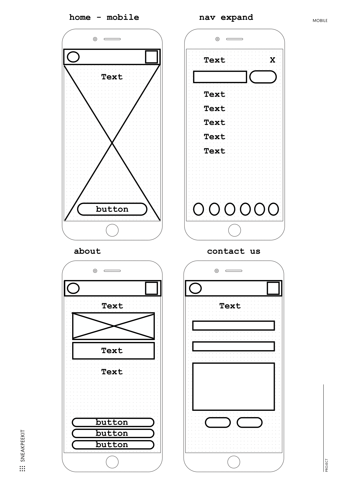

# TABLE OF CONTENT
## 1. [Wireframes](#_wireframes)
- [Home app](###_home_app)
- [Blogboard] (###_blogboard_app)
-

2. [Screenshots](#_screenshots)

# WIREFRAMES 

### HOME APP
    * DESKTOP

&nbsp;

    * TABLET

&nbsp;

    * MOBILE
    

### BLOGBOARD APP
    * DESKTOP

&nbsp;

    * TABLET

&nbsp;

    * MOBILE

&nbsp;

# Screenshots
### Registered and logged in user 
Landing Page Navigator 

### Anonymous User
Landing Page Navigator 
